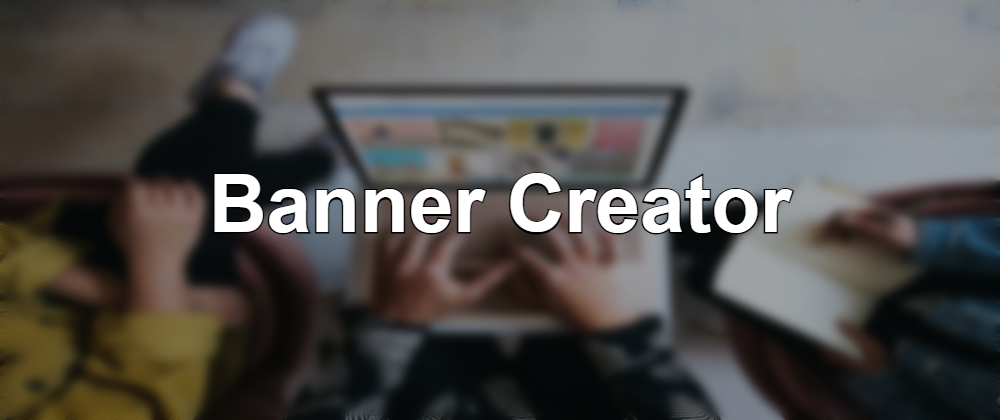

# 🎨 Banner Creator

<div align="center">


**Create stunning, professional banners in seconds**

[](https://reactjs.org/)
[](https://www.typescriptlang.org/)
[](https://vitejs.dev/)
[](https://tailwindcss.com/)
[](https://www.w3.org/WAI/WCAG21/quickref/)
[](https://opensource.org/licenses/MIT)

[✨ Live Demo](http://localhost:3001) · [📖 Documentation](#-features) · [🐛 Report Bug](https://github.com/kasuken/banner-creator/issues) · [💡 Request Feature](https://github.com/kasuken/banner-creator/issues)



</div>

---

## ✨ Features

<table>
<tr>
<td width="50%">

### 🎯 **Core Features**
- 📝 **Rich Text Editor** with line break support
- 🎨 **8 Premium Fonts** to choose from
- 📏 **Font Size Control** (32-160px)
- 🌈 **Dual Color Picker** (text & border colors)
- 🖼️ **7 Aspect Ratios** for different platforms
- 📸 **Unsplash Integration** for backgrounds
- 🌫️ **Blur Control** (0-20px)
- 💾 **One-Click Download** as PNG

</td>
<td width="50%">

### ♿ **Accessibility First**
- ⌨️ **Full Keyboard Navigation**
- 🔊 **Screen Reader Optimized**
- 🎯 **WCAG 2.1 AA Compliant**
- 🔍 **Skip Links** for efficiency
- 🎨 **High Contrast** support
- 📱 **Responsive Design**
- 🚀 **Performance Optimized**
- 🌐 **Semantic HTML5**

</td>
</tr>
</table>

---

## 🚀 Quick Start

### Prerequisites

- **Node.js** 16.x or higher
- **npm** or **yarn**
- **Unsplash API Key** (free tier available)

### Installation

```bash
# Clone the repository
git clone https://github.com/kasuken/banner-creator.git

# Navigate to project directory
cd banner-creator

# Install dependencies
npm install

# Create environment file
cp .env.example .env

# Add your Unsplash API key to .env
# VITE_UNSPLASH_ACCESS_KEY=your_api_key_here

# Start development server
npm run dev
```

Visit **http://localhost:3000** and start creating! 🎉

---

## 📸 Screenshots

### Main Interface


---

## 🎯 Use Cases

<table>
<tr>
<td align="center" width="25%">
<br/>
<b>Blog Headers</b><br/>
<sub>16:9 & 1000:420</sub>
</td>
<td align="center" width="25%">
<br/>
<b>LinkedIn Posts</b><br/>
<sub>Multiple formats</sub>
</td>
<td align="center" width="25%">
<br/>
<b>Social Media</b><br/>
<sub>Custom sizes</sub>
</td>
<td align="center" width="25%">
<br/>
<b>Articles</b><br/>
<sub>Featured images</sub>
</td>
</tr>
</table>

---

## 🛠️ Technology Stack

### Frontend
- **[React 18](https://reactjs.org/)** - UI Library
- **[TypeScript](https://www.typescriptlang.org/)** - Type Safety
- **[Vite](https://vitejs.dev/)** - Build Tool
- **[TailwindCSS](https://tailwindcss.com/)** - Styling

### APIs & Services
- **[Unsplash API](https://unsplash.com/developers)** - High-quality images
- **Canvas API** - Banner rendering

### Development Tools
- **ESLint** - Code linting
- **PostCSS** - CSS processing
- **Autoprefixer** - CSS compatibility

---

## 📖 Documentation

### Available Scripts

```bash
# Start development server
npm run dev

# Build for production
npm run build

# Preview production build
npm run preview

# Lint code
npm run lint
```

### Environment Variables

Create a `.env` file in the root directory:

```env
VITE_UNSPLASH_ACCESS_KEY=your_unsplash_api_key_here
```

Get your free API key from [Unsplash Developers](https://unsplash.com/developers).

### Aspect Ratios

| Platform | Format | Dimensions | Use Case |
|----------|--------|------------|----------|
| **Blog** | 16:9 | 1600×900px | Standard blog header |
| **Blog** | 1000:420 | 1000×420px | dev.to banner |
| **LinkedIn** | Square | 1080×1080px | Post image |
| **LinkedIn** | Landscape | 1920×1080px | Post image |
| **LinkedIn** | Article Featured | 1200×644px | Article header |
| **LinkedIn** | Article Banner | 600×322px | Compact banner |
| **LinkedIn** | Blog Link | 1200×627px | Shared links |

---

## ♿ Accessibility

Banner Creator is built with accessibility as a core principle, meeting **WCAG 2.1 Level AA** standards.

### Key Features

✅ **Keyboard Navigation** - Full keyboard support with visible focus indicators  
✅ **Screen Readers** - Optimized for NVDA, JAWS, VoiceOver, and TalkBack  
✅ **ARIA Labels** - Comprehensive ARIA attributes for all interactive elements  
✅ **Color Contrast** - All text meets 4.5:1 contrast ratio minimum  
✅ **Semantic HTML** - Proper landmarks and heading hierarchy  
✅ **Skip Links** - Quick navigation for keyboard users  
✅ **Live Regions** - Dynamic content updates announced  
✅ **Reduced Motion** - Respects user preferences  

[Read full accessibility documentation →](./WCAG_COMPLIANCE.md)

---

## 🎨 Customization

### Fonts

The app includes 8 premium fonts:
- Arial
- Helvetica
- Georgia
- Times New Roman
- Courier New
- Verdana
- Impact
- Comic Sans MS

### Color Presets

10 carefully selected preset colors for quick selection:
- White (`#ffffff`)
- Black (`#000000`)
- Red (`#ef4444`)
- Orange (`#f97316`)
- Yellow (`#eab308`)
- Green (`#22c55e`)
- Blue (`#3b82f6`)
- Purple (`#a855f7`)
- Pink (`#ec4899`)
- Gray (`#6b7280`)

Plus custom color picker for unlimited options!

---

## 🤝 Contributing

Contributions are what make the open source community amazing! Any contributions you make are **greatly appreciated**.

### How to Contribute

1. **Fork** the Project
2. **Create** your Feature Branch (`git checkout -b feature/AmazingFeature`)
3. **Commit** your Changes (`git commit -m 'Add some AmazingFeature'`)
4. **Push** to the Branch (`git push origin feature/AmazingFeature`)
5. **Open** a Pull Request

### Development Guidelines

- Follow the existing code style
- Write meaningful commit messages
- Add tests for new features
- Update documentation as needed
- Ensure WCAG compliance for UI changes

---

## 🐛 Known Issues & Limitations

- Canvas rendering may vary slightly between browsers
- Color picker accessibility varies by browser implementation
- Unsplash API rate limits apply (50 requests/hour for free tier)

See [open issues](https://github.com/yourusername/banner-creator/issues) for a full list of known issues and feature requests.

---

## 📝 Roadmap

- [ ] 🎨 More font families and Google Fonts integration
- [ ] 🖼️ Image upload from local device
- [ ] 📐 Custom aspect ratio creator
- [ ] 💾 Save templates for reuse
- [ ] 🎭 Gradient text support
- [ ] ✏️ Text shadow and effects
- [ ] 🌍 Multi-language support
- [ ] 📱 Mobile app version
- [ ] 🤖 AI-powered design suggestions
- [ ] 🔗 Direct social media sharing

---

## 📄 License

Distributed under the **MIT License**. See [`LICENSE`](LICENSE) for more information.

This means you can:
- ✅ Use commercially
- ✅ Modify
- ✅ Distribute
- ✅ Use privately

---

## 🙏 Acknowledgments

### Powered By

- **[Unsplash](https://unsplash.com/)** - Beautiful, free images
- **[Heroicons](https://heroicons.com/)** - SVG icons
- **[React](https://reactjs.org/)** - JavaScript library
- **[Vite](https://vitejs.dev/)** - Frontend tooling
- **[TailwindCSS](https://tailwindcss.com/)** - Utility-first CSS

### Inspiration

- Modern web design principles
- Accessibility-first development
- User experience best practices

---

## 💖 Support

If you find this project helpful, please consider:

- ⭐ **Starring** the repository
- 🐛 **Reporting** bugs and issues
- 💡 **Suggesting** new features
- 🤝 **Contributing** code
- 📢 **Sharing** with others

---

<div align="center">

### 🌟 Star History

[](https://star-history.com/#kasuken/banner-creator&Date)

---

**Made with ❤️ by [Kasuken](https://github.com/kasuken)**
*Create beautiful banners. Share your stories. Make an impact.*

[⬆ Back to Top](#-banner-creator)

</div>
